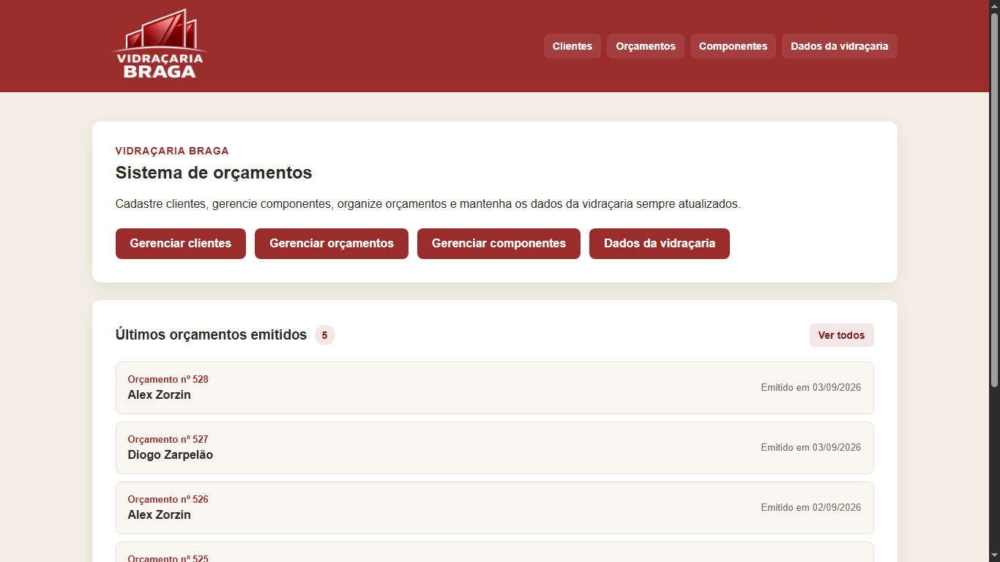
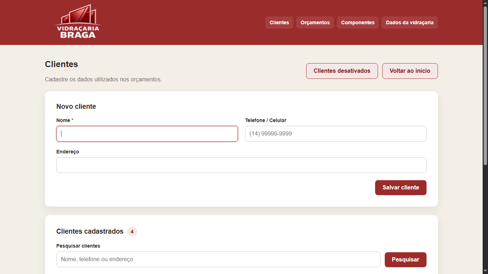
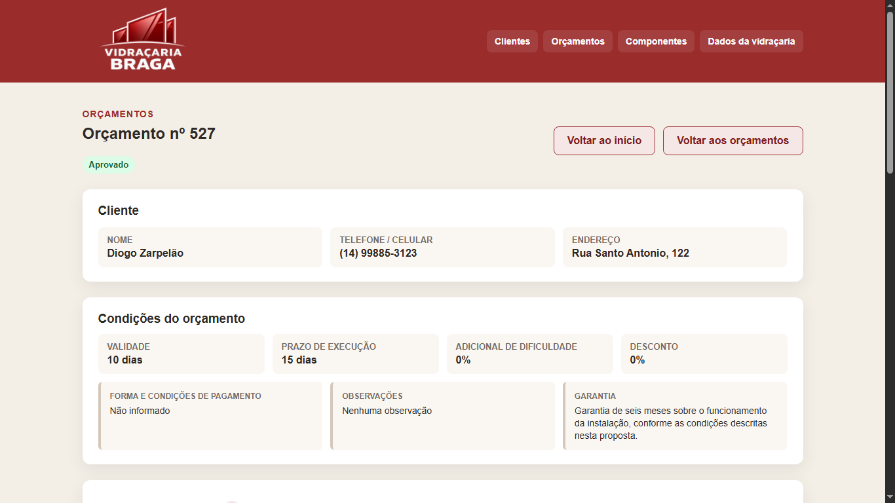
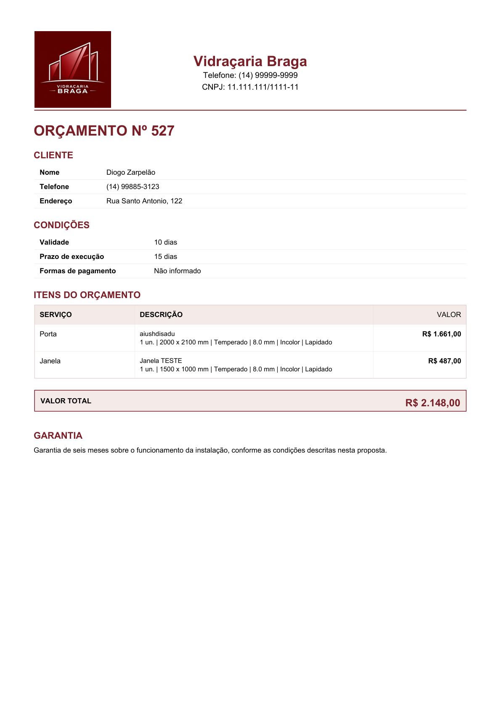
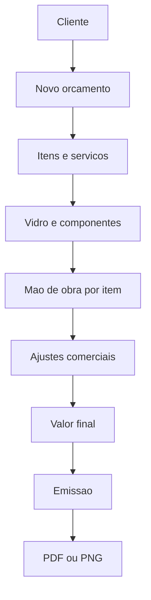

# Braga Budget

<p align="center">
  Sistema de orçamentos para vidraçaria, com cálculos comerciais, gestão de clientes e geração de propostas em PDF e PNG.
</p>

<p align="center">
  
  
  
  
  
</p>

## Demonstração visual

### Home — Desktop

<p align="center">
  
</p>

### Gerenciamento de clientes

<p align="center">
  
</p>

### Detalhe do orçamento

<p align="center">
  
</p>

### Proposta comercial

<p align="center">
  
</p>

## Sobre o projeto

O **Braga Budget** é uma aplicação web desenvolvida para agilizar e padronizar a criação de orçamentos para serviços de vidraçaria.

O sistema nasceu de uma necessidade real de operação da **Vidraçaria Braga** e centraliza cadastro de clientes, componentes, montagem de serviços, cálculos comerciais, emissão de propostas e exportação de documentos.

A versão atual funciona localmente em Windows, utilizando **Flask** no backend e **SQLite** para persistência dos dados.

A aplicação também possui executável e instalador próprios para Windows.

## Principais funcionalidades

### Gestão

- cadastro, edição, ativação e inativação de clientes;
- cadastro e gerenciamento de componentes;
- configuração dos dados da empresa;
- numeração automática de orçamentos;
- controle de status;
- consulta de orçamentos emitidos.

### Orçamentos

- criação de orçamentos em rascunho;
- múltiplos serviços por orçamento;
- cálculo automático da área do vidro;
- componentes individuais por item;
- cálculo automático da mão de obra;
- ajuste manual da mão de obra;
- adicional de dificuldade;
- aplicação de desconto;
- ajuste manual do valor final;
- distribuição proporcional do valor comercial entre os itens;
- controle de validade e prazo de execução;
- formas de pagamento;
- observações e garantia;
- bloqueio de alterações após emissão.

### Exportação

- proposta comercial em PDF;
- exportação em PNG;
- apresentação de valores comerciais consolidados;
- preservação da composição interna de custos.

## Fluxo da aplicação



## Formação do valor

Cada item possui sua própria composição interna.

```text
Vidro
  + Componentes
  + Mao de obra
  + Ajustes comerciais
        |
        v
Valor comercial do item
        |
        v
Valor final do orcamento
```

A mão de obra automática corresponde a **50% da soma do vidro com os componentes do item** e pode ser substituída manualmente.

Quando o valor final é alterado, o sistema distribui a diferença proporcionalmente entre os itens.

A distribuição utiliza o valor original de cada item como peso e garante que a soma dos valores comerciais seja exatamente igual ao valor final apresentado ao cliente.

## Proposta comercial

O PDF gerado apresenta somente as informações necessárias para a proposta:

- identidade e dados da empresa;
- número do orçamento;
- dados do cliente;
- validade;
- prazo de execução;
- forma de pagamento;
- serviços;
- descrição técnica;
- valor comercial de cada item;
- valor total;
- garantia.

Componentes, mão de obra, descontos, adicionais e demais informações utilizadas internamente na formação do preço não são discriminados separadamente no documento comercial.

## Tecnologias

| Camada | Tecnologias |
|---|---|
| Backend | Python, Flask 3.1.3 |
| Frontend | HTML5, CSS3, JavaScript, Jinja2 |
| Banco de dados | SQLite |
| PDF | ReportLab |
| Imagens | PyMuPDF, Pillow |
| Executável | PyInstaller |
| Instalador | Inno Setup |
| Versionamento | Git, GitHub |
| Documentação | Markdown |

## Estrutura principal

```text
braga-budget/
|
|-- app/
|   |-- static/
|   |   |-- css/
|   |   |-- icons/
|   |   |-- images/
|   |   `-- js/
|   |
|   |-- templates/
|   |-- __init__.py
|   |-- db.py
|   |-- routes.py
|   `-- schema.sql
|
|-- docs/
|   `-- screenshots/
|
|-- tests/
|-- BragaBudget.iss
|-- requirements.txt
|-- run.py
`-- README.md
```

## Execução local

### Requisitos

- Python;
- pip;
- navegador moderno.

### Backend

Crie e ative o ambiente virtual:

```powershell
python -m venv .venv
.venv\Scripts\Activate.ps1
```

Instale as dependências:

```powershell
pip install -r requirements.txt
```

Execute a aplicação:

```powershell
python run.py
```

O sistema será iniciado em:

```text
http://127.0.0.1:5000
```

O navegador padrão é aberto automaticamente.

## Persistência local

Durante o desenvolvimento, o banco SQLite utiliza:

```text
instance/braga_budget.sqlite
```

Na aplicação instalada no Windows:

```text
%LOCALAPPDATA%\BragaBudget\braga_budget.sqlite
```

O banco fica separado dos arquivos do programa, permitindo atualizar ou reinstalar a aplicação sem depender do banco dentro do diretório de instalação.

## Testes e qualidade

A versão atual foi validada durante o desenvolvimento e também em uso real.

Entre as validações realizadas estão:

- cálculos de área e valores;
- mão de obra individual;
- distribuição proporcional do valor final;
- persistência do banco local;
- emissão de orçamentos;
- geração de PDF;
- exportação PNG;
- executável Windows;
- instalação e execução em outro computador.

O desenvolvimento utiliza Git com commits incrementais e versionamento do código-fonte no GitHub.

## Segurança e privacidade

- bancos SQLite locais não são versionados;
- arquivos de build e instalação não fazem parte do repositório;
- dados pessoais reais não devem ser incluídos em exemplos públicos;
- screenshots de portfólio devem utilizar dados fictícios ou anonimizados;
- a versão atual opera localmente e não expõe diretamente a aplicação à internet.

## Status

A **v1.0 local está funcional, instalada e validada em uso real**.

O projeto permanece em desenvolvimento ativo e continuará evoluindo conforme novas necessidades forem identificadas.

## Autor

**Diogo Zarpelão**

Desenvolvimento full stack, arquitetura da aplicação, regras de negócio, banco de dados, interface, geração de documentos, distribuição para Windows e documentação técnica.

GitHub: [@diogozarpelo](https://github.com/diogozarpelo)

## Uso

Este repositório é apresentado para fins de estudo, demonstração técnica e portfólio profissional.

Todos os direitos reservados.
